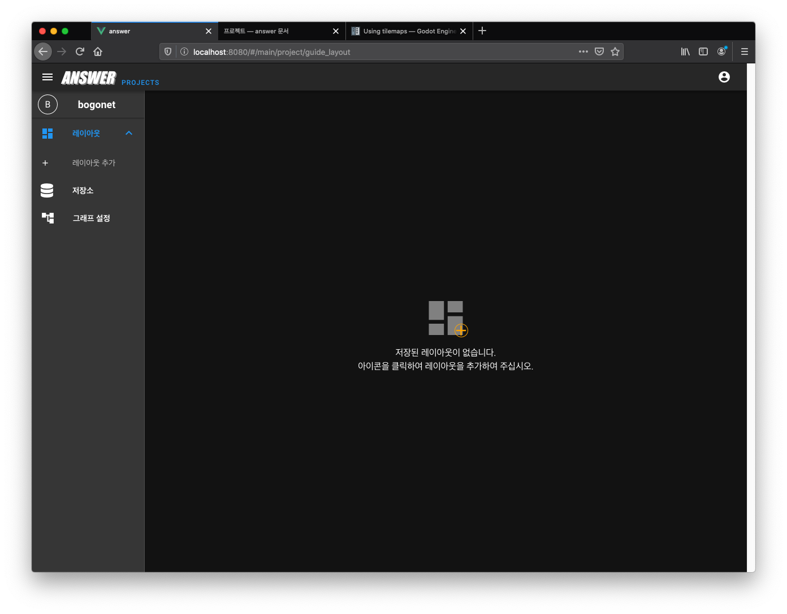
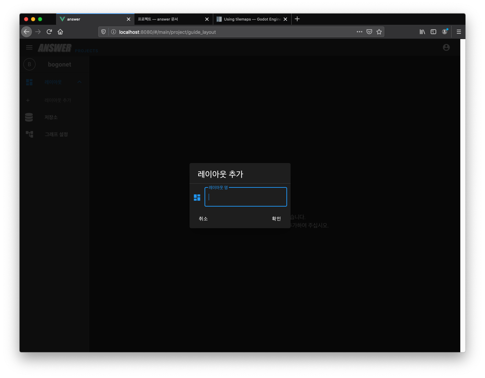
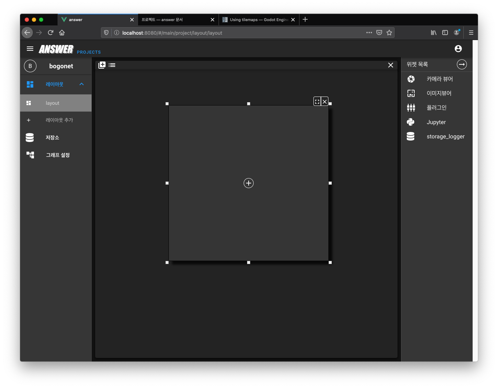
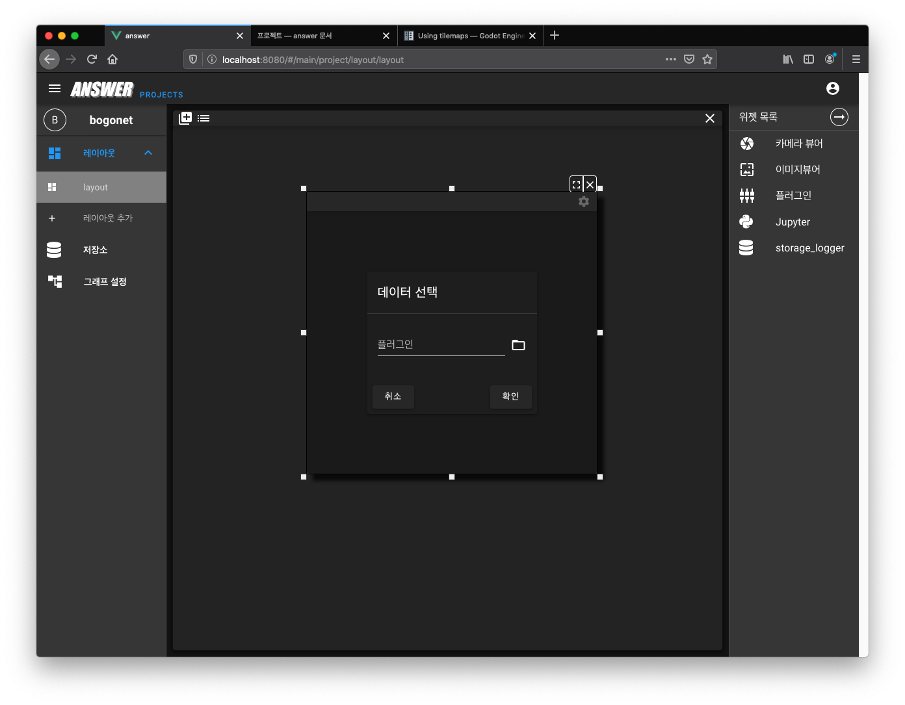

.. meta::
    :keywords: DASHBOARD

.. _doc-start-dashboard:

대시보드
========

대시보드는 모니터링, 사용자 설정, 리소스 관리 등을 위한 위젯(Widget)을 배치할 수 있는 공간입니다.

새로운 레이아웃
---------------

레이아웃은 배치된 위젯의 프리셋 역할을 합니다.
사용자는 원하는 레이아웃에 원하는 방법으로 위젯을 배치할 수 있습니다.

레이아웃이 존재하지 않다면 다음과 같은 화면이 출력됩니다.

중앙의 "+" 버튼 또는 좌측의 "레이아웃 추가" 버튼을 클릭하면 새로운 레이아웃을 생성할 수 있습니다.

위젯 배치
---------

위젯은 사용자와 상호 작용할 수 있는 인터페이스 요소 입니다.

새로운 레이아웃이 생성되면 "빈 패널" 을 확인할 수 있고,
빈 패널의 "+" 버튼을 클릭하면 우측에 "위젯 목록" 이 출력됩니다.

원하는 위젯을 "빈 패널" 위에 드래그-앤-드롭 하면 해당 위젯이 배치됩니다.

이 경우 "플러그인 위젯" 을 사용했습니다.
"플러그인 위젯" 은 외부의 웹 페이지를 임베딩 할 수 있는 위젯입니다.

원하는 URL을 입력하면 외부 페이지가 위젯에 포함됩니다.
원하는 YouTubue 의 "퍼가기" 주소를 사용하면 다음 화면과 같이 동영상 재생이 가능합니다.

.. image:: img/dashboard-5.png

