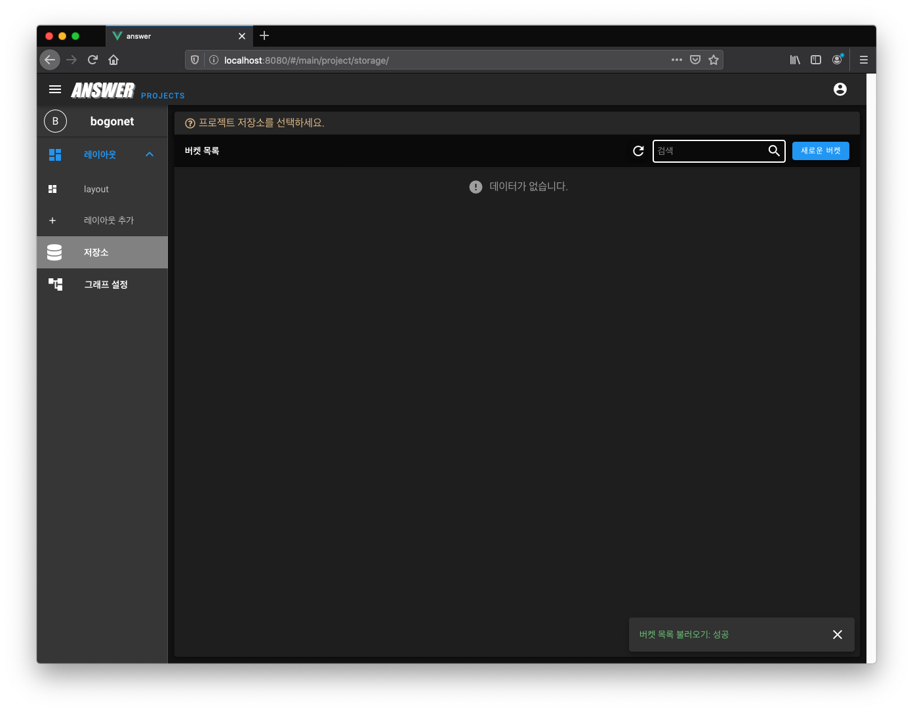
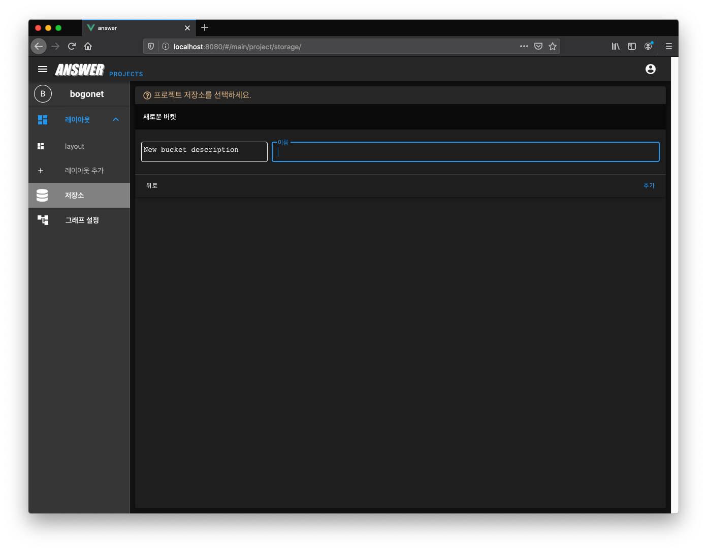
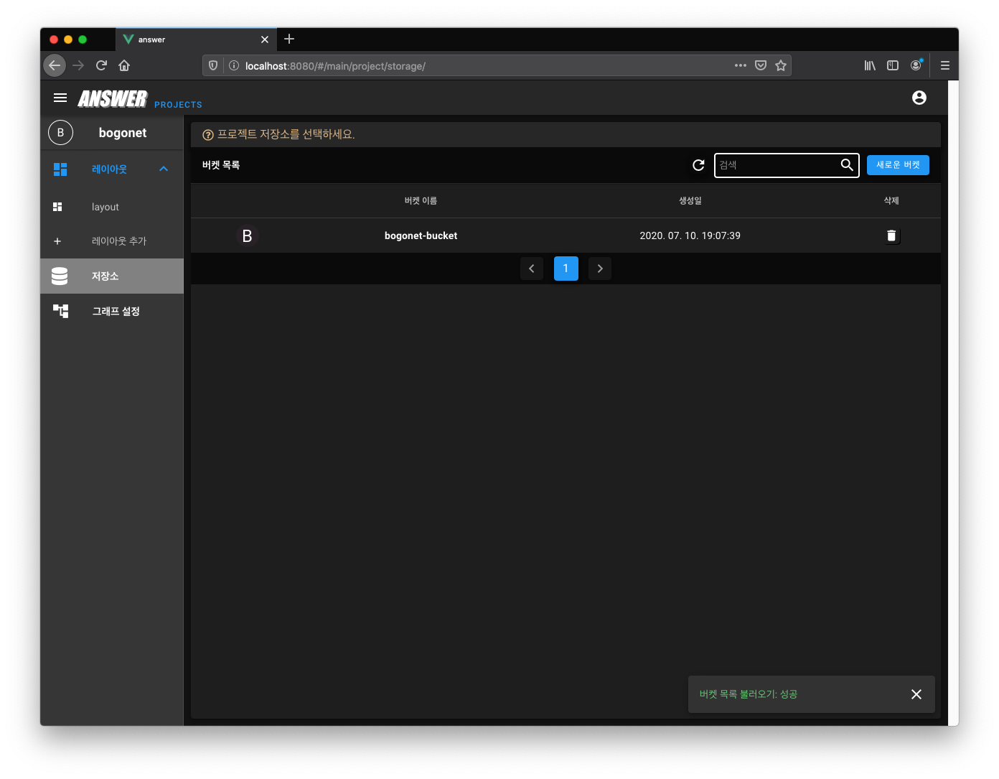
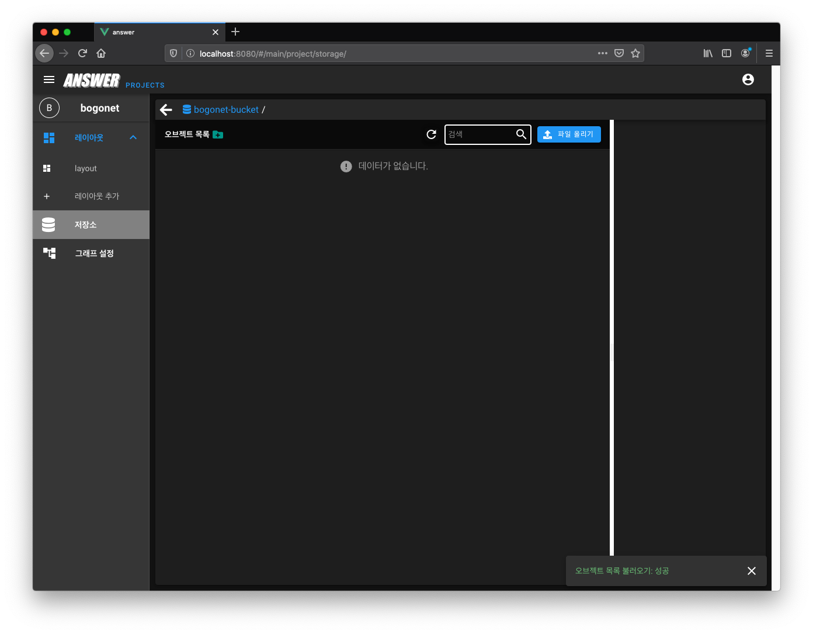
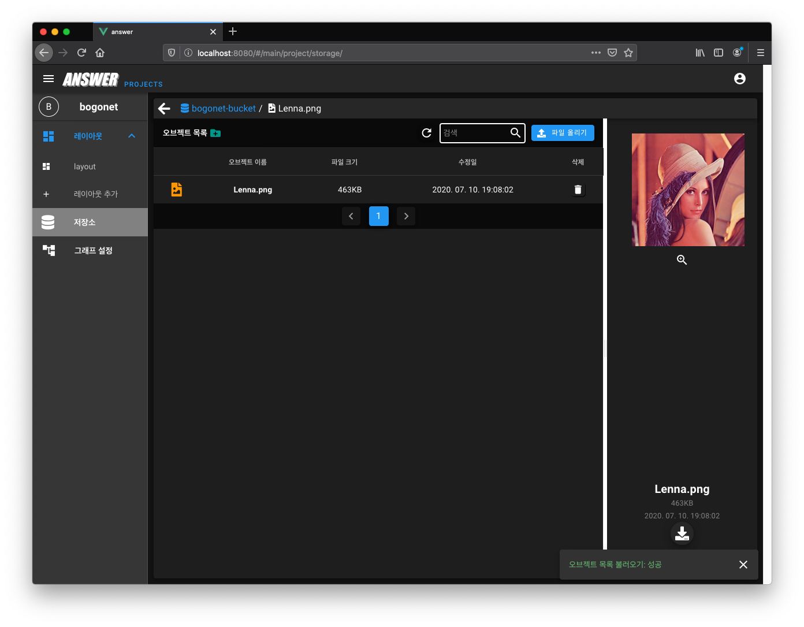

.. meta::
    :keywords: STORAGE

.. _doc-start-storage:

저장소
======

저장소는 원하는 사용자의 컨텐츠를 관리하는 페이지 입니다.
"엔서"는 웹 상에 서비스 되어, 사용자의 리소스를 공유할 수 있는 공간이 필요하게 됩니다.

이 가이드는 저장소를 웹 페이지 상에서 사용하는 방법을 사용자에게 제시합니다.

저장소 목록
-----------

처음 프로젝트에 진입하면 저장소에 아무것도 없습니다.

저장소에 데이터(사진, 동영상, 음성, 문서 등)를 업로드하려면 우선 버킷을 만들어야 합니다.
그런 다음 이 버킷을 선택하여 해당 위치에 업로드 할 수 있습니다.

여기서 "버킷"은 데이터를 저장할 컨테이너입니다.
모든 데이터는 어떤 버킷에 포함돼야 합니다.

데이터를 저장하고 싶다면 "새로운 버캣" 버튼을 클릭합니다.

새로운 버킷 이름을 입력하면 됩니다.

.. warning::
    현재, 버킷명은 영문 소문자 또는 숫자만 지원합니다.

이제 새로운 버킷이 생성되었습니다.
버킷 이름을 클릭하여 버킷에 진입하거나 원한다면 삭제할 수 있습니다.

"파일 올리기" 버튼을 클릭하여 버킷에 사용자의 데이터를 업로드 할 수 있습니다.

업로드된 오브젝트 이름을 클릭하면 파일의 내용을 확인할 수 있습니다.
또는 원한다면 사용자가 파일을 제거할 수도 있습니다.

