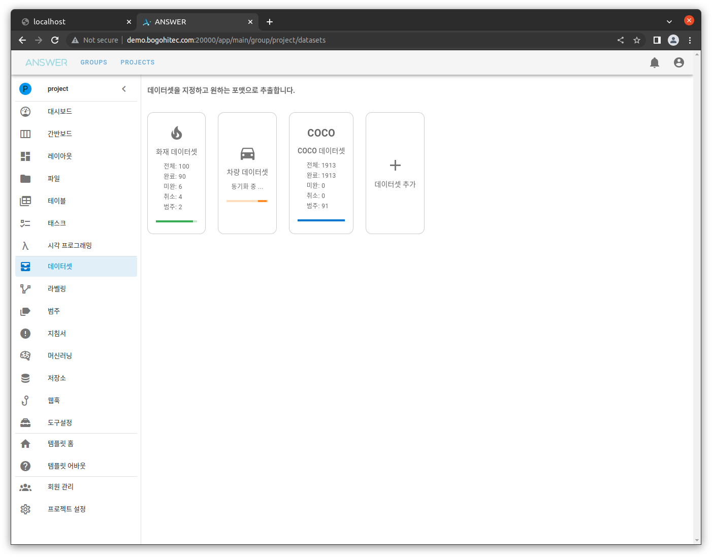
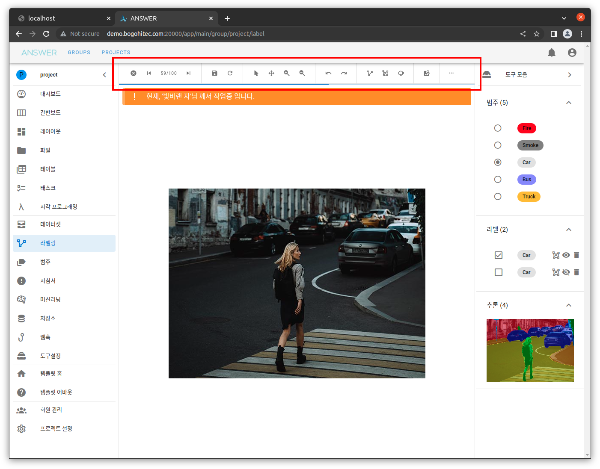
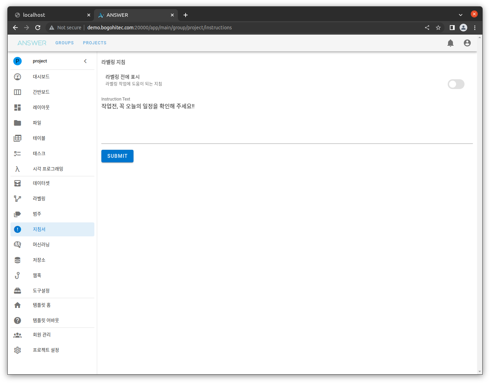
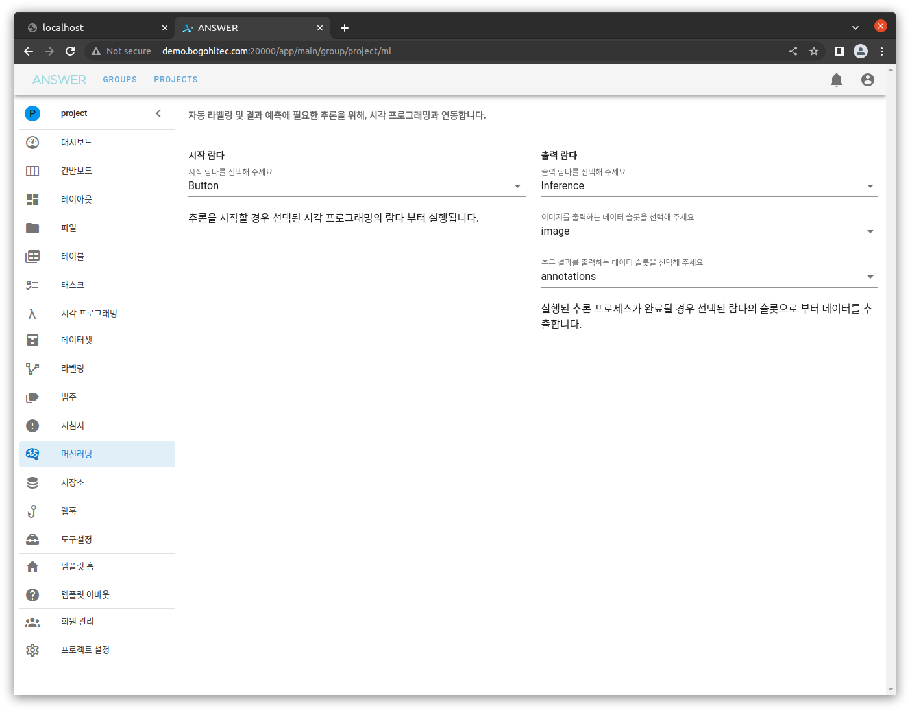
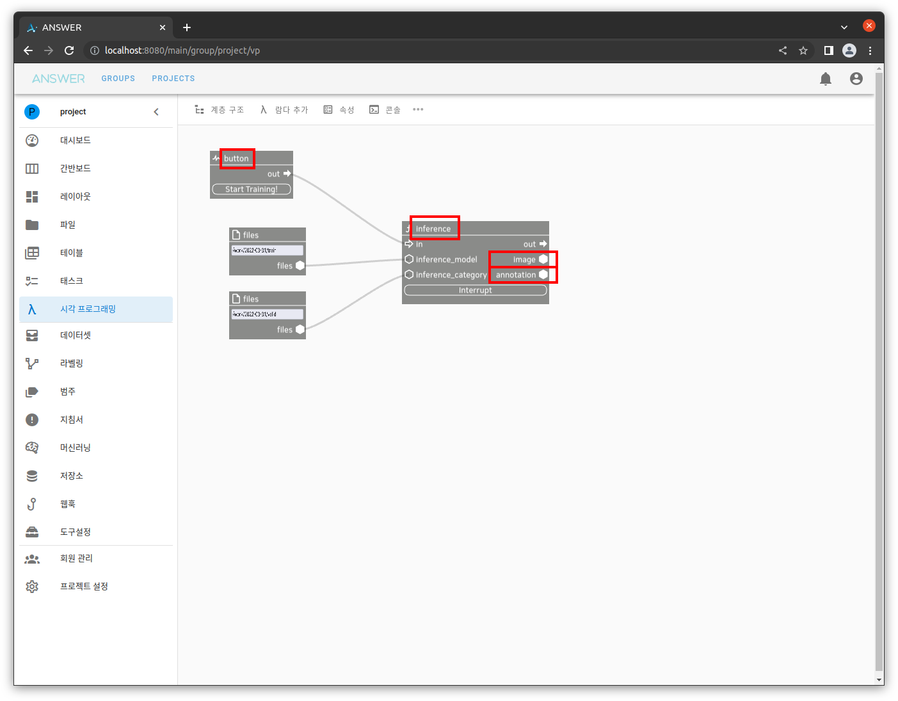
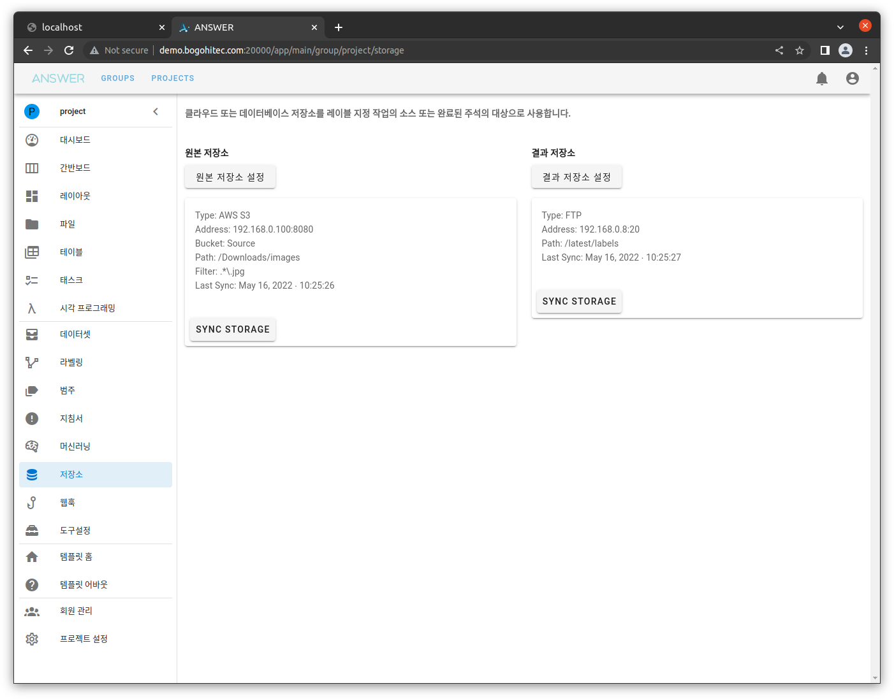
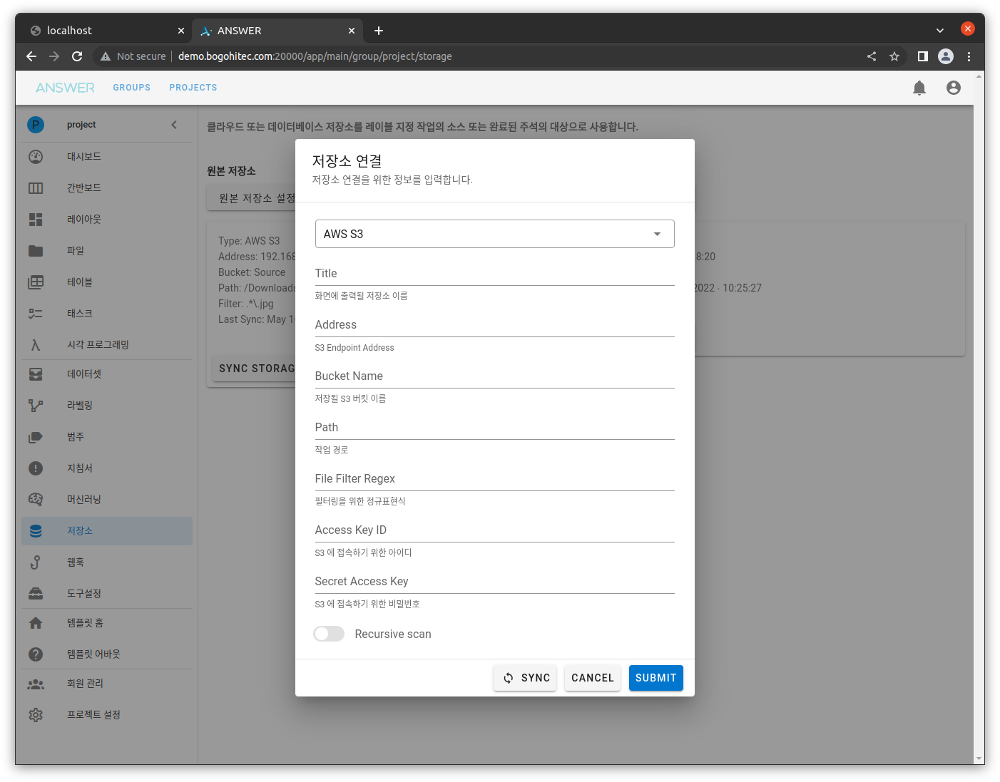
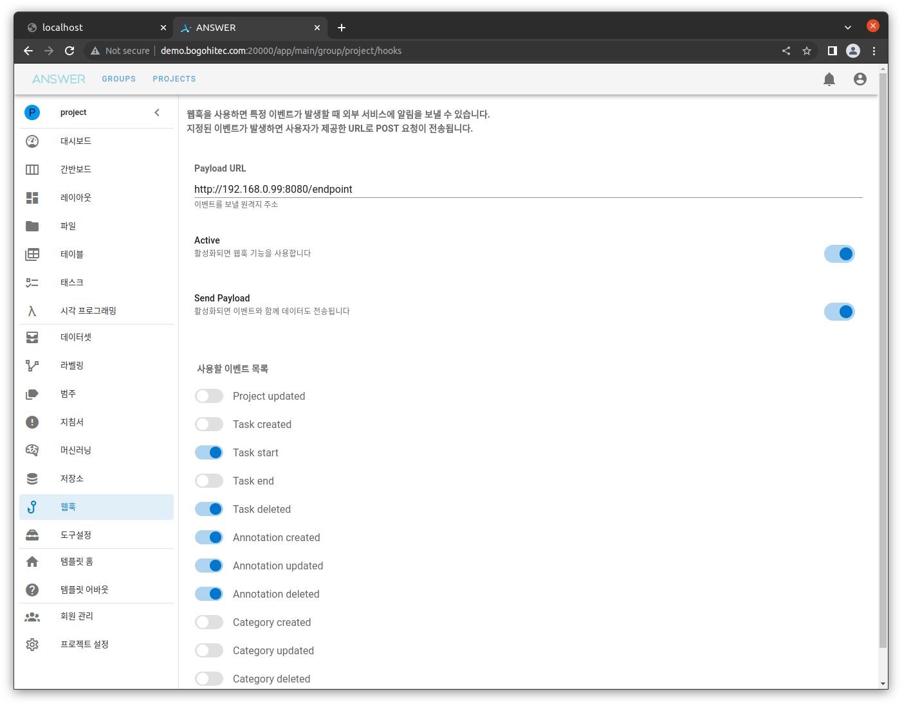
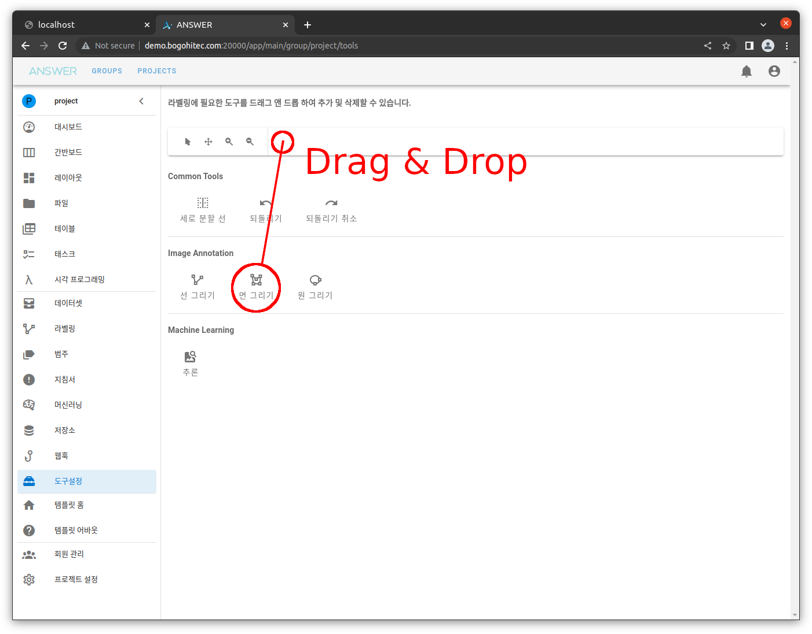

# Annotation Tools

## 개요

머신러닝을 위한 라벨링 작업 도구 모음 입니다.

하나의 프로젝트에 가입된 모든 회원들은 수정된 라벨링 레이아웃, 데이터셋, 범주(Category) 등을 공유합니다.

## 데이터셋

라벨링 데이터셋 그룹을 조직화 합니다.

데이터셋을 추가하거나 만들어진 데이터셋을 COCO JSON FORMAT, VOC XML FORMAT 등 여러 포맷을 추출할 수 있습니다.

## 라벨링

라벨링 작업을 진행할 수 있는 메인 화면 입니다.

상단, 붉은 박스에 해당 하는 **도구바** 부분을 후에 설명할 **도구설정** 화면에서 제어할 수 있습니다.

## 범주

라벨링에 사용될 범주(Category)를 추가하거나 삭제할 수 있습니다.

선택된 색상은 라벨링시 선 또는 면 색상에 영향을 줍니다.

## 지침서

라벨링 시작 직전에 팝업 알람으로 출력할 공지사항 입니다.

## 머신러닝

라벨링시 추론 결과를 실시간으로 확인하거나 자동 라벨링에 사용할 머신러닝 규칙을 적용합니다.

[Visual Programming](./project.md) 에서 구성한 시작 람다와 출력 람다를 선택하면

해당 그래프가 실행되고, 실행 결과를 자동 라벨링 결과로 사용됩니다.

## 저장소

프로젝트에 사용할 원격 저장소를 연결할 수 있습니다.

- **원본 저장소** 는 원본 데이터가 저장된 위치를,
- **결과 저장소** 는 라벨링 결과를 저장할 위치를 선택할 수 있습니다.

저장소는 [AWS S3](https://en.wikipedia.org/wiki/Amazon_S3) 와 같은 클라우드 저장소 뿐만 아닌,
FTP, SMB 등도 선택할 수 있습니다.

## 웹훅

Annotation 도구 사용시 발생되는 여러 이벤트를 원하는 웹 서버로 전송(HTTP Request)할 수 있습니다.

이벤트는 다음과 같은 것들이 있습니다.

- 프로젝트 업데이트
- 작업(Task) 생성
- 작업(Task) 시작
- 작업(Task) 종료
- 작업(Task) 삭제
- 라벨(Annotation) 생성
- 라벨(Annotation) 업데이트
- 라벨(Annotation) 제거
- 범주(Category) 생성
- 범주(Category) 업데이트
- 범주(Category) 제거

## 도구설정

라벨링에 필요한 도구를 추가/삭제할 수 있습니다.

하단의 도구 중 원하는 기능을 드래그 & 드롭으로 상단 툴바에 배치하면 라벨링 페이지에서 해당 도구를 사용할 수 있습니다.
