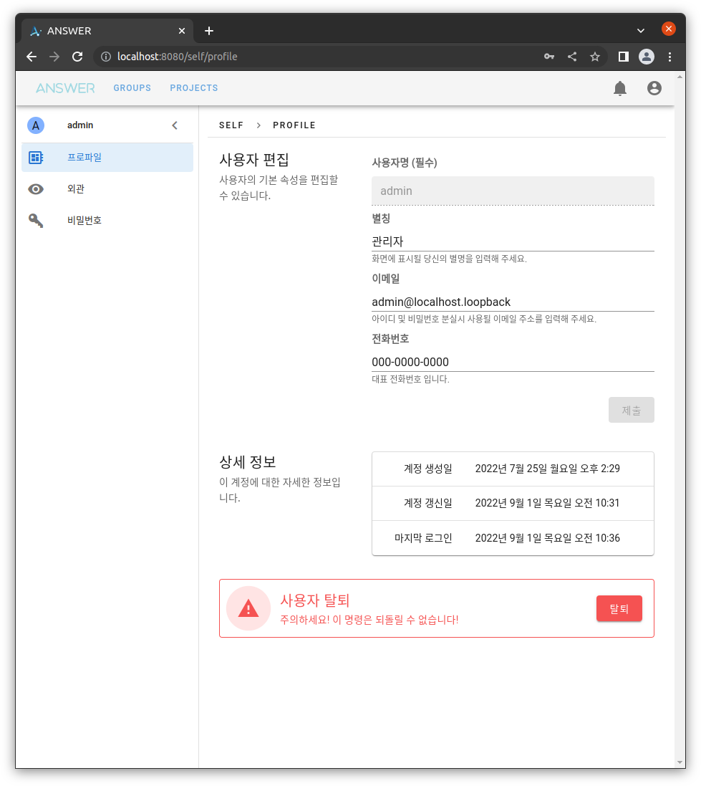
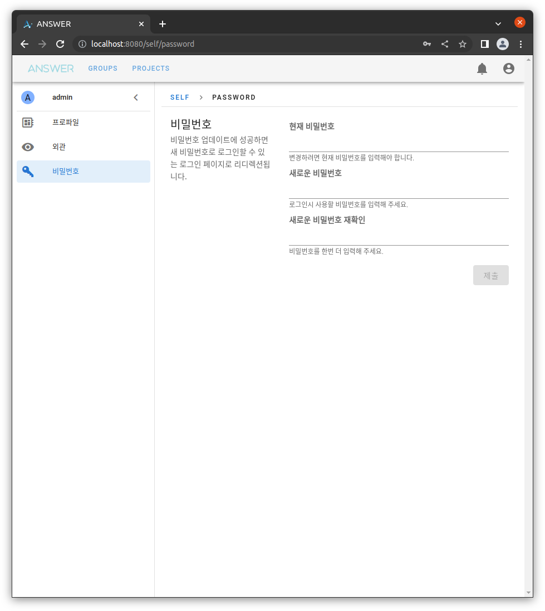

# 개인 설정

모든 계정은 변경 가능한 고유한 `설정 정보`를 가지고 있습니다. 이 `설정 정보`를 변경할 수 있는 페이지 입니다.

## 프로파일

사용자의 기본정보를 확인하거나 수정할 수 있습니다.
*(단 `사용자명`은 변경할 수 없습니다)*

상세정보는 다음과 같습니다:

- 계정를 생성한 날짜
- 계정 정보를 수정한 날짜
- 마지막 로그인 날짜

하단의 `탈퇴` 버튼을 클릭하면 영구적인 계정삭제가 진행됩니다.
탈퇴가 적용되면 관련 데이터 모두 삭제됩니다.

## 외관

화면 출력에 관련된 변경 가능한 설정 목록 입니다.

### 어두운 화면

스위치가 꺼져 있다면 **밝은 테마**, 켜져 있다면 **어두운 테마**를 적용합니다.

### 언어

번역 테이블이 제공된 언어 목록을 선택할 수 있습니다. 현재 지원되는 언어는 다음과 같습니다.

- 한글
- English

### 시간대

- 출력되는 **지역 시간(Local Time)** 의 위치를 조정할 수 있습니다.

## 비밀번호

설정된 비밀번호를 변경할 수 있습니다.

