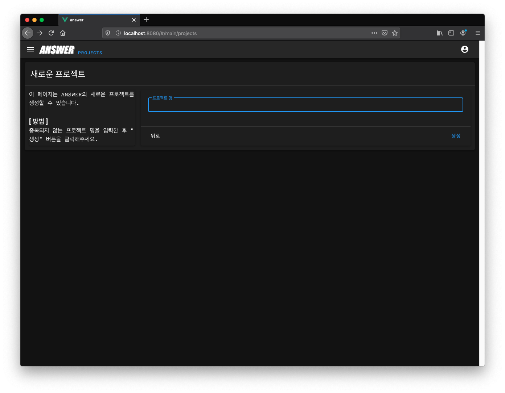

.. meta::
    :keywords: PROJECT

.. _doc-start-project:

프로젝트
========

프로젝트는 일정한 목적을 달성하기 위한 태스크의 집합입니다.

프로젝트는 동일한 그룹 안에 모인 사람들이 일정한 권한 아래 공유할 수 있으며
필요에 따라 새로운 프로젝트를 생성할 수 있습니다.

.. warning::
    현재, 그룹 및 권한 기능은 작동하지 않습니다.
    모든 회원이 모든 프로젝트를 권한 없이 공유됩니다.

프로젝트 목록
-------------

로그인 성공 후 첫 번째로 확인할 수 있는 화면은, 프로젝트 선택 화면 입니다.

이 화면에서 프로젝트 목록을 확인할 수 있습니다.
다음과 같은 작업이 가능합니다.

- 프로젝트 선택/집입
- 프로젝트 상세 정보 확인
- 프로젝트 제거
- 프로젝트 생성

프로젝트 생성
-------------

"프로젝트 생성" 버튼을 클릭하면 새로운 프로젝트를 생성할 수 있는 페이지로 전환됩니다.

프로젝트명을 입력한 후 "생성" 버튼을 클릭하면 해당 프로젝트가 생성됩니다.

.. warning::
    현재, 프로젝트명은 영문 소문자 또는 숫자만 지원합니다.
    그 밖의 문자를 사용하면 프로젝트는 생성되지만 몇몇 중요한 기능이 작동하지 않을 수 있습니다.

